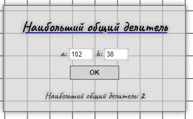

<h1 align="center">Математические калькуляторы</h1>

<h2 align="center">Описание</h2>

Шесть разных калькуляторов, которые позволяют произвести несложные вычисления по некоторым формулам:
1. Корни квадратного уравнения - расчитывает сколько корней у квадратного уровнения

2. Тройка Пифагора - проверяет, являются ли введеные числа тройкой Пифагора.

3. Делители числа - выводит все делители введенного числа.

4. Общие делители двух чисел - находит общие делители для двух введенных чисел.

5. Наибольший общий делитель - находит наибольший общий делитель для двух введенных чисел.

6. Наименьшее общее кратное - находит наименьшее общее кратное для двух введенных чисел.

<h2 align="center">Как использовать</h2>

Просто ввести данные в поля калькулятора и нажать кнопку ОК.

<h2 align="center">Технологии</h2>

В этом проекте использовались: 
* HTML
* CSS
* JavaScript

<h2 align="center">Дополнительно</h2>

Этот проект является практикой к [этому учебнику](http://code.mu/ru/javascript/book/practice/)

